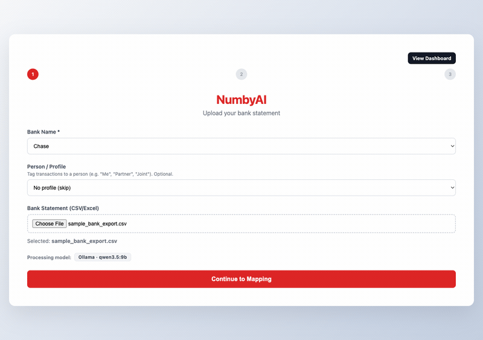
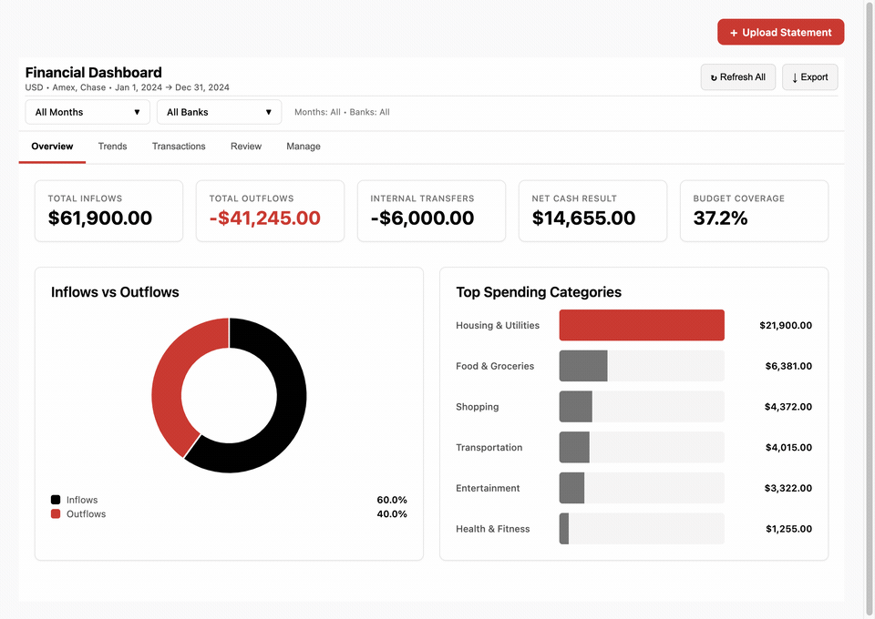
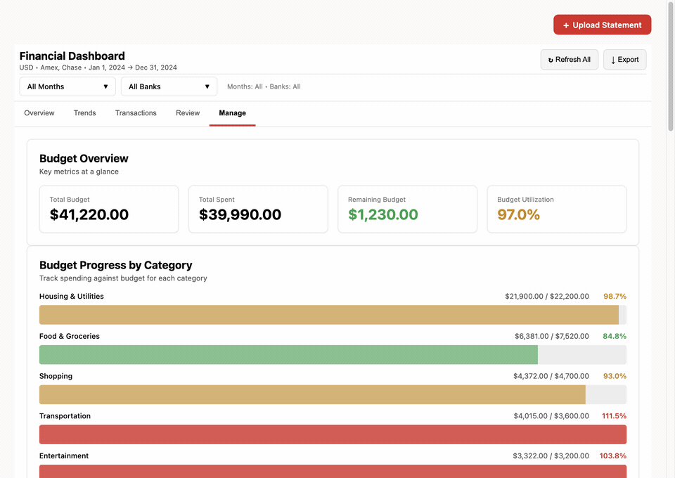

# NumbyAI


**Local-first AI finance categorizer. Your bank data never leaves your machine.**

Upload any bank statement CSV and NumbyAI automatically detects the format, categorizes every transaction using a local LLM (Ollama), and surfaces patterns across months. No cloud. No subscriptions. No data sharing.

---

## Demo

> **Updated walkthrough:** [Watch on YouTube →](https://www.youtube.com/watch?v=lF8CLE2W5FI)

### Upload & AI Categorization
Drop a bank statement CSV and watch NumbyAI auto-detect columns and categorize every transaction using a local LLM.



### Dashboard
Track spending by category, monitor budgets, and analyze cash flow trends — all from a single view.



### Rule Advisor
The Rule Advisor analyzes your categorization patterns and suggests reusable rules, making future uploads instant.



---

## What it does

1. **Drop any CSV** — the heuristic parser detects metadata rows, column layout, date format, currency, and number format automatically, without you mapping anything. Falls back to the LLM when confidence is low.
2. **Rule engine runs first** — saved patterns (regex, bank-specific, amount filters) categorize known transactions instantly, without touching the LLM.
3. **LLM handles the rest** — remaining transactions are batched and sent to Ollama in parallel workers. Confident results are committed; ambiguous ones go to the review queue.
4. **Review queue** — flag-and-resolve UI with bulk select, conflict detection, and one-click rule creation from any pattern.
5. **Rule analysis** — analyzes all your transactions for inconsistencies and suggests new rules to clean up historical data.
6. **Dashboard** — category breakdowns, month-over-month trends, cash flow, budget vs actual.

---

## Statement Parser — Technical Overview

Most tools require you to manually map columns. NumbyAI's heuristic engine handles the messy reality of real-world bank exports:

### What gets auto-detected

| Signal | How |
|---|---|
| **Metadata preamble rows** | Scans from top, finds first row with both a date and a numeric value — everything above is skipped |
| **Column roles** | Scores each column independently (date density, numeric density, text length, emptiness) |
| **Inflow/Outflow split** | Detects adjacent complementary numeric columns (one empty when the other isn't) — common in UK/EU exports |
| **Date format** | Pattern-matches against 9 formats: `YYYY-MM-DD`, `DD/MM/YYYY`, `MM/DD/YYYY`, `DD.MM.YYYY`, `DD Mon YYYY`, short-year variants |
| **Number format** | Distinguishes EU (`1.234,56`) from US (`1,234.56`) by counting comma/dot separator signals |
| **Currency** | Detects from symbols (`$€£¥₹₽₩`) and ISO codes (`USD EUR GBP PLN CHF` etc.) in headers and data cells |
| **Balance column** | Identifies monotonically-signed numeric columns near the amount column |

### Supported bank formats (tested)

| Bank / Format | Country | Notes |
|---|---|---|
| Chase | 🇺🇸 US | 7-column with Post Date and Category |
| Bank of America | 🇺🇸 US | 4-column, running balance |
| Wells Fargo | 🇺🇸 US | No header row |
| Barclays | 🇬🇧 UK | Inflow/outflow split columns |
| HSBC | 🇬🇧 UK | Metadata preamble, separate debit/credit |
| ING | 🇳🇱 NL | Semicolon-delimited, EU number format |
| Sparkasse | 🇩🇪 DE | Semicolon-delimited, EU decimals, multi-row metadata |
| UBS | 🇨🇭 CH | CHF currency detection, preamble rows |
| BNP Paribas | 🇫🇷 FR | Semicolon-delimited, signed amounts |
| NAB | 🇦🇺 AU | AUD, debit/credit columns |
| Tab-delimited | Any | Auto-detected |
| Pipe-delimited | Any | Auto-detected |
| Generic w/ metadata | Any | Account info header rows auto-skipped |

When heuristic confidence is low, the LLM is called with a structured prompt and the first 15 rows to fill the gaps. Heuristic results always win when confident.

---

## Categorization Pipeline

```
Upload CSV
    │
    ▼
Statement Analyzer
  ├─ Heuristic engine  ──── high confidence ──▶ column mapping resolved
  └─ LLM fallback      ──── low confidence  ──▶ LLM fills gaps
    │
    ▼
Rule Engine  ◀─── saved preferences (regex patterns, bank filters)
  ├─ Match found  ──▶ category applied instantly
  └─ No match     ──▶ LLM batch queue
    │
    ▼
Ollama (parallel workers, configurable batch size)
  ├─ Confident result  ──▶ category committed
  └─ Uncertain         ──▶ MANUAL_REVIEW flag
    │
    ▼
Review Queue
  ├─ Bulk select + assign category
  ├─ Per-transaction rule creation
  └─ Conflict resolution (AI vs reviewer)
    │
    ▼
Dashboard
```

---

## Features

- **Zero-config format detection** — works on statements with metadata headers, blank rows, split debit/credit columns, EU/US number formats, and 9 date format variants
- **Multi-currency** — detects and stores transaction currency; dashboard handles mixed-currency months
- **Parallel LLM batching** — configurable worker count and batch size; processes large statements fast
- **Rule analysis** — post-hoc analysis finds categorization conflicts and suggests new rules across historical data
- **Bulk review UI** — checkbox select-all, bulk categorize, inline conflict resolution
- **Budget tracking** — set monthly budgets per category, visualized against actuals
- **Multi-bank** — each upload is tagged to a bank; rules can be bank-specific or global
- **Auth optional** — runs in single-user mode with no auth required; plug in Auth0 for multi-user
- **SQLite (dev) / PostgreSQL (prod)** — swap via `DATABASE_URL`
- **Privacy first** — no telemetry, no external API calls, runs entirely on your machine

---

## Architecture

```
┌──────────────────────────────────────────────────────┐
│                    Browser (:8000)                    │
│  ┌────────────────┐      ┌─────────────────────────┐ │
│  │  Upload Wizard  │      │  Dashboard              │ │
│  │  (SimpleUpload) │      │  Charts · Budgets ·     │ │
│  │  Auto-detection │      │  Review · Trends        │ │
│  └────────────────┘      └─────────────────────────┘ │
└──────────────────┬───────────────────────────────────┘
                   │ REST + SSE (streaming)
┌──────────────────▼───────────────────────────────────┐
│              FastAPI Server (:8000)                   │
│  ┌─────────────┐ ┌──────────┐ ┌────────────────────┐ │
│  │  Statement  │ │  Rule    │ │  Ollama LLM        │ │
│  │  Analyzer   │ │  Engine  │ │  (parallel batches)│ │
│  └─────────────┘ └──────────┘ └────────────────────┘ │
│  ┌─────────────────────────────────────────────────┐  │
│  │         SQLite (dev) / PostgreSQL (prod)        │  │
│  └─────────────────────────────────────────────────┘  │
└──────────────────────────────────────────────────────┘
                   │
┌──────────────────▼───────────────────────────────────┐
│              Ollama (:11434)                          │
│              Local LLM — default: qwen3.5:9b         │
└──────────────────────────────────────────────────────┘
```

---

## Categories

`Income` · `Housing & Utilities` · `Food & Groceries` · `Transportation` · `Insurance` · `Healthcare` · `Shopping` · `Entertainment` · `Travel` · `Debt Payments` · `Internal Transfers` · `Investments` · `Other`

---

## Prerequisites

| Dependency | Version | Notes |
|---|---|---|
| Python | 3.11+ | Backend runtime |
| Node.js | 18+ | Frontend build |
| Ollama | Latest | Local LLM inference |

---

## Quick Start

Works on **Windows**, **macOS**, and **Linux**. The only prerequisites are Python 3.11+, Node.js 18+, and Ollama.

```bash
# 1. Clone
git clone https://github.com/RoXsaita/NumbyAI-Public.git
cd NumbyAI-Public

# 2. Install Ollama and pull the default model
python run.py setup-ollama

# 3. Copy env file
cp server/.env.example server/.env          # macOS / Linux
copy server\.env.example server\.env        # Windows (cmd)

# 4. Start everything (venv, deps, migrations, frontend build, server)
python run.py start
```

App runs at **http://localhost:8000**.

Upload the included `sample_bank_export.csv` — it's a realistic two-month export with metadata header rows, recurring merchants, and edge cases designed to exercise the parser.

---

## Project Structure

```
NumbyAI-Public/
├── server/
│   ├── app/
│   │   ├── main.py                    # API routes
│   │   ├── config.py                  # Pydantic settings
│   │   ├── database.py                # SQLAlchemy models
│   │   ├── services/
│   │   │   ├── statement_analyzer.py  # Heuristic format detection + LLM fallback
│   │   │   ├── categorization_rules.py
│   │   │   ├── llm_service.py         # Ollama client + batching
│   │   │   └── ollama_service.py
│   │   └── tools/
│   │       └── statement_parser.py    # CSV/XLSX → transaction rows
│   ├── tests/
│   │   ├── fixtures/                  # Real-world format CSVs (Chase, Barclays, ING, ...)
│   │   └── test_statement_analyzer.py
│   ├── alembic/                       # DB migrations
│   └── Dockerfile
├── web/
│   └── src/
│       ├── components/SimpleUpload.tsx  # Upload wizard
│       ├── widgets/dashboard.tsx        # Main dashboard
│       └── lib/api-client.ts
├── sample_bank_export.csv             # Two-month test statement with metadata preamble
├── run.py                            # Cross-platform CLI (Windows / macOS / Linux)
└── Makefile                          # macOS / Linux shortcut (optional)
```

---

## Configuration

All config via environment variables. See [`server/.env.example`](server/.env.example).

| Variable | Description | Default |
|---|---|---|
| `DATABASE_URL` | DB connection string | `sqlite:///./finance_recon.db` |
| `SECRET_KEY` | JWT signing key | `dev-only-not-for-production` |
| `OLLAMA_URL` | Ollama server URL | `http://localhost:11434` |
| `OLLAMA_MODEL` | Model for categorization | `qwen3.5:9b` |
| `CATEGORIZATION_BATCH_SIZE` | Transactions per LLM batch | `20` |
| `CATEGORIZATION_MAX_WORKERS` | Parallel batch workers | `2` |
| `AUTH0_DOMAIN` | Auth0 domain (optional) | Disabled |

---

## Development

All commands work on Windows, macOS, and Linux via `run.py`:

```bash
python run.py start          # Stop → migrate → build → start
python run.py stop           # Kill the server
python run.py logs           # Tail backend logs
python run.py check          # ruff + mypy + pytest
python run.py setup-ollama   # Install/verify Ollama + pull model
python run.py test-e2e       # End-to-end categorization (requires Ollama)
python run.py clear-db       # Delete the SQLite database
```

<details>
<summary>macOS / Linux shortcut (Makefile)</summary>

If you have `make` installed, the Makefile still works:

```bash
make restart        # Stop → migrate → build → start
make stop           # Kill all services
make logs           # Tail backend logs
make check-python   # ruff + mypy + pytest
make test-e2e       # End-to-end categorization (requires Ollama)
```
</details>

### Run tests

```bash
cd server
pytest tests --cov=app --cov-report=term-missing
```

### Frontend

```bash
cd web && npm install && npm run build
# Dev mode with mock data (no backend needed):
npm run build:dev
```

No separate dev server — FastAPI serves the built frontend as static files.

---

## Platform Notes

### Windows

- Use `python` instead of `python3` (Windows Python installer registers `python`).
- Ollama: install from [ollama.com/download/windows](https://ollama.com/download/windows) or `winget install Ollama.Ollama`.
- The `Makefile` requires GNU Make (e.g. via Git Bash or WSL) — use `run.py` instead.

### Linux

- Ollama: `curl -fsSL https://ollama.com/install.sh | sh`.
- Everything else works out of the box.

### macOS

- Ollama: `brew install ollama`.
- Both `run.py` and `make` work.

---

## Deployment

### Docker Compose (quickest)

```bash
# 1. Build the frontend first
cd web && npm install && npm run build && cd ..

# 2. Start the app + Ollama
docker-compose up

# 3. Pull the model inside the Ollama container (first run only)
docker-compose exec ollama ollama pull qwen3.5:9b
```

App runs at **http://localhost:8000**. Data is persisted in Docker volumes (`sqlite_data`, `ollama_data`).

### Production (PostgreSQL)

A `Dockerfile` and `railway.toml` are included. For production:

1. Set `DATABASE_URL` to a PostgreSQL connection string
2. Set `SECRET_KEY` to a secure random value
3. Set `ENVIRONMENT=production`
4. Point `OLLAMA_URL` at your Ollama instance

---

## License

[MIT](LICENSE)
